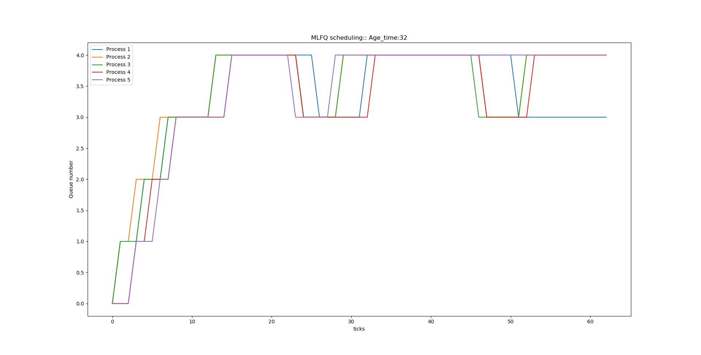

# Assignment 4 : Enhancing XV-6

Done By

- Harish Umasankar (2020102067)
- Pranav Manu (2020112019)

## Specification 1

### System Call 1 : `trace`

- Added `mask` variable to `struct proc` in proc.h, to store the mask of the processes to be traced
- Modified `fork()` function to copy mask from parent to child
- Modified `syscall()` function to the information regarding a system call, if the system call is to be traced
- Created a user program called `strace.c`, that takes mask and the command to be traced as input and sets the mask of the process and runs the function command given.


### System Call 2: `sigalarm` and `sigreturn`

`sigalarm`

`trap.c` 

- When timer gets interrupted, if `sigalarm` is enabled, then number of ticks are counted.

- If number of ticks is equal to n, then the interrupt handler function is called.

`sigreturn`

- resets the number of ticks 


## Specification 2: Scheduling

### a. First Come First Serve FCFS

- Updated `struct proc` to store process is created
- Edited `allocproc()` to initialise the new variable created above
- Modified code in `scheduler()` to pick the process with the earliest time of creation

### b. Lottery Based Scheduling

- Implemented a random function to randomly assign CPU time to a process proportional to the number of tickets in the process

### c. Priority Based Scheduling PBS

`setpriority`

- Added function to defs.h
- Defined function in proc.c to take new priority and pid of process as arguments and return old priority of process
- Added sys_setpriority to syscalls list in syscall.c
- Defined SYS_setpriority to 25 in syscall.h
- Made a user program setpriority.c to take user input and call setpriority() syscall
- Updated usys.pl with setpriority entry

#### Working of PBS

- PBS is a non preemptive priority based scheduler that selects the process with the highest priority for execution
- By default, all process are assigned priority of 60
- <u>Rule for Breaking Ties</u>
  - When two processes have the same priority, we compare the number of time the process has been scheduled.
  - When two process are  scheduled same number of times, then we pick the process with the lower start time.


#### Implementation

- Update struct proc with following attributes
  - priority
  - dynPriority 
  - niceness
  - numTimes
  - runTime
  - sleepTime
- Assigned above attributes to default values inside allocproc.
- Updated numTimes inside proc.c whenever a process is scheduled
- Modified trap.c to increment runTime and sleepTime of process
- Modified scheduler() to select process with highest priority as below
  - Iterate through every process and update process priority based on niceness and dynamic priority rule
  - If the process is runnable, then we compare if the process has higher priority and based on the rules described above, we update variable `highPriorityProcess`
  - When process with highest priority is obtained, we switch the context of the current process with the process with highest priority.


### d. Multi Level Feedback Queue MLFQ

- Created 5 queues, to implement multi level queues that shift processes between  the queues with ageing
- Created struct Que with following attributes
  - head Pointer of proc type 
  - tail Pointer of proc type
  - int num_proc
- (struct proc edits)

- Updated `allocproc() ` to initialize the new structure attirbutes 
- Updated scheduler() to pick the process with highest priority
- Edited `usertrap()` to see if current process has expired its time slice or not


The MACROS are changed in the object files, which are not tracked by the makefile. Hence we need to run this command

```shell
make clean
```

to recreate all the object files.


## Specification 3: Copy-on-write fork

`uvmcopy()` is changed so that every times its called its adds reference to the same physical address without allocating new page.

Writing on the page is disabled for both the processes

Changes Made

- Changed trap.c such that when a write-pagefault is encountered, a page is allocated to the faulting process and write bit is set. 
- RSW bit is used to check if PTE is pointing to a COW page or not.
- copyout is edited to handle page fault in a similar manner as to usertrap


**Timing Analysis**

| Scheduler                  | Average Running Time | Average Waiting Time |
| -------------------------- | -------------------- | -------------------- |
| Round Robin                | 40                   | 78                   |
| First Come First Serve     | 33                   | 80                   |
| Lottery Based Scheduler    | 32                   | 80                   |
| Priority Based Scheduler   | 36                   | 81                   |
| Multi Level Feedback Queue | 32                   | 86                   |


### Specification 4: MLFQ Analysis

Timeline plot for processes managaed by MLFQ Scheduler




## Running the xv6

- Run the below command in the command line `make qemu SCHEDULER=[OPTIONS]`
- The various scheduler options available are
  - RR for Round Robin
  - FCFS for First Come First Serve
  - LBS for Lottery Based Scheduler
  - PBS for Priority Based Scheduling
  - MLFQ for Multi Level Feedback Queue

- By default the operating system schedules process based on Round Robin Scheduling

